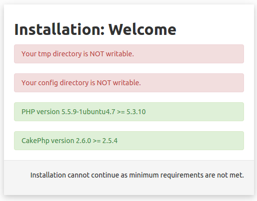
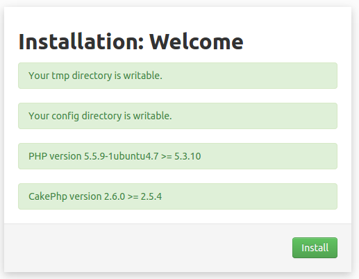

# Installing Croogo

## Installing on Ubuntu

### Installing on Nginx Server

```
server {
    listen   80;
    server_name croogo.dev;

    # root directive should be global
    root   /home/rakesh/public_html/croogo;
    index  index.php;

    access_log /var/log/nginx/access.log;
    error_log /var/log/nginx/error.log;

    location / {
        try_files $uri $uri/ /index.php?$uri&$args;
    }

    location ~ \.php$ {
        try_files $uri =404;
        include /etc/nginx/fastcgi_params;
        fastcgi_pass    unix:/var/run/php5-fpm.sock;
        fastcgi_index   index.php;
        fastcgi_param   SCRIPT_FILENAME $document_root$fastcgi_script_name;
    }
}

```

- Download Latest version of Croogo from [http://downloads.croogo.org/].
- Extract the zip folder into your web directory
- 

### Installing on Apache Server

### Setting Up Database


When first time visiting the page you may encounter such problem. This is a sign that minimum requirements are not met.

You will need to give enough permissions to your server on your development machine.

```sudo chown -R $USER:www-data path/to/croogo```

If all is good, you will be asked to proceed to installation.


#### Database Settings

